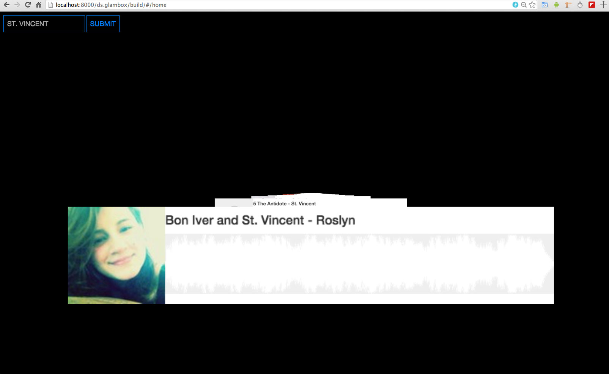

ds.glamBox
(DemoScene).glamBox
=============
<pre>

  _______  ___           __      ___      ___ _______    ______ ___  ___  
 /" _   "||"  |         /""\    |"  \    /"  |   _  "\  /    " \"  \/"  | 
(: ( \___)||  |        /    \    \   \  //   (. |_)  :)// ____  \   \  /  
 \/ \     |:  |       /' /\  \   /\\  \/.    |:     \//  /    ) :)\  \/   
 //  \ ___ \  |___   //  __'  \ |: \.        (|  _  \(: (____/ ///\.  \   
(:   _(  _( \_|:  \ /   /  \\  \|.  \    /:  |: |_)  :)        //  \   \  
 \_______) \_______|___/    \___)___|\__/|___(_______/ \"_____/|___/\___| 
                                                                          
This product was enabled by thousands of passionate developers including 
but not limited to the following:\

http://en.wikipedia.org/wiki/Brendan_Eich
http://ricardocabello.com/blog
http://ejohn.org/
http://praystation.com/
http://threejs.org/
https://angularjs.org/
http://www.airtightinteractive.com/
http://tparisi.github.io/glam/
http://jeromeetienne.github.io/slides/webaudioapi/#1
http://hypeframework.org/
https://processing.org/
by SeaCloud9 - made with passion somewhere on the left coast -> under a MIT license 

In short it's like a soundcloud jukeBox plus your own personal virtualVJ
</pre>

  
Simple threeJS / GLAM example using shaders, web audio, processingJS, hypeframework, soundcloud, passion and awesomenss.  This is a work in progress so expect to see lots of updates
   

